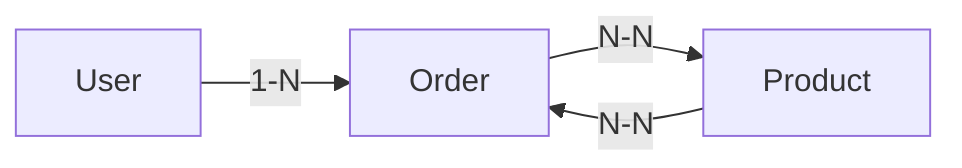

Voici un modèle de README complet pour votre projet GitHub :

```markdown
# 🚀 API de Gestion des Commandes

[](https://travis-ci.org/user/repo)
[](https://david-dm.org/user/repo)
[](https://opensource.org/licenses/MIT)

API REST pour la gestion de commandes avec Node.js, Express et Sequelize

## 📋 Table des matières
- [Fonctionnalités](#-fonctionnalités)
- [Prérequis](#-prérequis)
- [Installation](#-installation)
- [Variables d'environnement](#-variables-denvironnement)
- [Endpoints API](#-endpoints-api)
- [Requêtes complexes](#-requêtes-complexes)
- [Validations](#-validations)
- [Associations](#-associations)
- [Tests](#-tests)
- [Contribuer](#-contribuer)
- [Licence](#-licence)

## 🌟 Fonctionnalités
- Gestion complète des utilisateurs, produits et commandes
- Validation des données côté serveur
- Transactions sécurisées pour les commandes
- Calcul automatique du montant total des commandes
- Gestion des stocks en temps réel

## 🛠 Prérequis
- Node.js v14+
- npm v7+
- MySQL 8+
- Postman/Thunder Client (pour les tests)

## 🚀 Installation
```bash
# Cloner le dépôt
git clone https://github.com/votre-utilisateur/order-management-api.git

# Installer les dépendances
cd order-management-api
npm install

# Créer la base de données MySQL
mysql -u root -p -e "CREATE DATABASE order_management"

# Démarrer le serveur
npm run dev
```

## 🔧 Variables d'environnement
Créez un fichier `.env` à la racine :
```env
DB_NAME=order_management
DB_USER=root
DB_PASSWORD=votre_mot_de_passe
DB_HOST=localhost
JWT_SECRET=votre_secret_jwt
PORT=5000
```

## 📡 Endpoints API

### Utilisateurs (`/api/users`)
| Méthode | Endpoint       | Description                |
|---------|----------------|----------------------------|
| POST    | /users         | Créer un utilisateur       |
| GET     | /users/:id     | Récupérer un utilisateur   |
| PUT     | /users/:id     | Mettre à jour utilisateur  |
| DELETE  | /users/:id     | Supprimer un utilisateur   |

### Produits (`/api/products`)
| Méthode | Endpoint       | Description                |
|---------|----------------|----------------------------|
| POST    | /products      | Ajouter un produit         |
| GET     | /products      | Lister tous les produits   |
| GET     | /products/:id  | Récupérer un produit       |
| PUT     | /products/:id  | Modifier un produit        |
| DELETE  | /products/:id  | Supprimer un produit       |

### Commandes (`/api/orders`)
| Méthode | Endpoint             | Description                     |
|---------|----------------------|---------------------------------|
| POST    | /orders              | Créer une commande             |
| GET     | /orders/:id          | Récupérer une commande         |
| GET     | /users/:id/orders    | Commandes d'un utilisateur     |

## 🔍 Requêtes complexes
### 1. Commandes avec produits associés
```http
GET /api/orders/1
```
```json
{
  "id": 1,
  "totalAmount": 199.98,
  "products": [
    {
      "name": "Clavier Mécanique",
      "price": 99.99,
      "quantity": 2
    }
  ]
}
```

### 2. Filtrage des produits par prix
```http
GET /api/products?minPrice=50
```

### 3. Top 5 des produits les plus commandés
```http
GET /api/products/top/most-ordered
```

## ✅ Validations
- **Utilisateurs** :
  - Email unique et valide
  - Mot de passe (min 6 caractères)
  
- **Produits** :
  - Prix > 0
  - Stock >= 0
  
- **Commandes** :
  - Vérification du stock avant commande
  - Quantité > 0

## 🔗 Associations


- **User** ↔ **Order** : Relation 1-N
- **Order** ↔ **Product** : Relation N-N via OrderProduct

## 🧪 Tests
1. Importer la collection Postman fournie
2. Exécuter les tests :
```bash
npm test
```
3. Vérifier les cas :
- Création de commande avec stock insuffisant
- Tentative de duplication d'email
- Modification de produit avec prix invalide

## 🤝 Contribuer
1. Forker le projet
2. Créer une branche (`git checkout -b feature/ma-nouvelle-fonctionnalite`)
3. Commiter les changements (`git commit -am 'Ajouter une fonctionnalité'`)
4. Pusher la branche (`git push origin feature/ma-nouvelle-fonctionnalite`)
5. Ouvrir une Pull Request

## 📄 Licence
Distribué sous licence MIT. Voir `LICENSE` pour plus d'informations.

## 📧 Contact
Votre Nom - [@Pierre OSSALE](https://www.linkedin.com/in/ossale-simon-pierre) - pierreossale.devweb@gmail.com

Project Link: [[https://github.com/votre-utilisateur/order-management-api](https://github.com/PierreOSSALE/order-management)]
